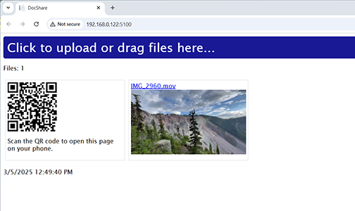

# DocShare

A simple file sharing tool that allows for easy temporary sharing of documents between computers and phones on the same network/WiFi.

It's meant to be a low friction way to transfer files/photos/videos without having to use cloud services.

# How to use

Start DocShare.exe. This will start a web server on port 5100 and open up a browser window to the main page.

The first time it runs, Windows will ask for permission to allow the program to communicate on the network. You must allow this for the program to work.

You can then drag and drop files onto the page or if using a phone, scan the QR code to open the page on your phone.

# Security

This tool is intended for a local trusted environment. Anyone on the same network can access your shared files.
It does not have any logins, passwords, encryption or security features other than an automatic 1 hour file expiration timer.

# Dependencies

This project uses FFMPEG to generate thumbnails of videos and images. 

You can download it from https://ffmpeg.org/download.html and place the ffmpeg.exe anywhere in a system path folder.

# License

Apache 2.0
